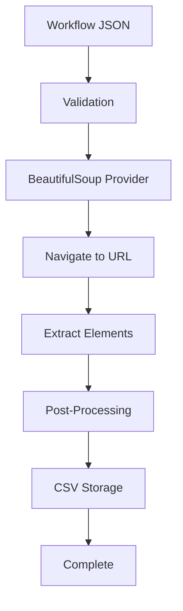

# Quick Start

Get up and running with Web Scrapper CLI in just 5 minutes! This guide will take you from installation to your first successful scraping workflow.

## 🎯 What You'll Learn

In this quickstart, you'll:
- ✅ Install Web Scrapper CLI
- ✅ Create your first workflow
- ✅ Run a scraping operation  
- ✅ View and understand the results
- ✅ Explore next steps

## 📋 Prerequisites

- Python 3.11 or higher
- Basic understanding of CSS selectors
- Terminal/command line access

## 🚀 Step 1: Installation

Install Web Scrapper CLI using pip:

```bash
# Install the CLI
pip install web-scrapper-cli

# Verify installation
scrapper --version
scrapper --help
```

You should see output like:
```
Web Scrapper CLI v1.0.0
A powerful web scraping framework with pluggable providers
```

## 📝 Step 2: Create Your First Workflow

Let's create a simple workflow to scrape news headlines. Create a file called `news-scraper.json`:

```json
{
  "version": "1.0.0",
  "metadata": {
    "name": "My First News Scraper",
    "description": "Extract news headlines from a demo news site",
    "author": "quickstart-user",
    "target_site": "https://example-news.com",
    "tags": ["news", "headlines", "beginner"]
  },
  "scraping": {
    "provider": "beautifulsoup",
    "config": {
      "parser": "lxml",
      "timeout": 30000,
      "headers": {
        "User-Agent": "Mozilla/5.0 (compatible; scrapper/1.0)"
      }
    }
  },
  "storage": {
    "provider": "csv",
    "config": {
      "file_path": "./news-headlines.csv",
      "headers": true,
      "delimiter": ","
    }
  },
  "steps": [
    {
      "id": "navigate",
      "command": "init",
      "config": {
        "url": "https://example-news.com",
        "wait_for": 2000
      },
      "retries": 3,
      "timeout": 30000
    },
    {
      "id": "extract-news",
      "command": "extract",
      "config": {
        "elements": {
          "headline": {
            "selector": "h2.headline, h1.title, .article-title",
            "type": "text"
          },
          "url": {
            "selector": "a",
            "type": "attribute",
            "attribute": "href"
          },
          "published_date": {
            "selector": ".date, .publish-date, time",
            "type": "text"
          },
          "summary": {
            "selector": ".summary, .excerpt, .description",
            "type": "text"
          }
        }
      },
      "retries": 3,
      "timeout": 45000
    }
  ],
  "post_processing": [
    {
      "type": "filter",
      "config": {
        "min_length": 5,
        "exclude_empty": true
      }
    },
    {
      "type": "transform",
      "config": {
        "strip_whitespace": true,
        "normalize_urls": true
      }
    }
  ]
}
```

## ✅ Step 3: Validate Your Workflow

Before running, let's validate the workflow to catch any errors:

```bash
scrapper validate news-scraper.json
```

Expected output:
```
✓ Workflow schema validation passed
✓ Provider 'beautifulsoup' available  
✓ Provider 'csv' available
✓ All workflow steps valid
✓ Configuration complete
✓ Workflow ready to execute

Summary:
  Name: My First News Scraper
  Steps: 2 (navigate, extract-news)
  Providers: beautifulsoup → csv
  Estimated runtime: 30-60 seconds
```

If you see any errors, double-check your JSON syntax and configuration.

## 🏃‍♂️ Step 4: Run Your First Scraping Operation

Now let's execute the workflow:

```bash
scrapper run news-scraper.json
```

You'll see real-time progress output:
```
🚀 Starting workflow: My First News Scraper
📋 Target: https://example-news.com

▶  Executing step: navigate
   → Navigating to https://example-news.com
   ✓ Page loaded successfully (1.2s)

▶  Executing step: extract-news  
   → Extracting elements with selectors
   → Found 15 headline elements
   → Found 15 URL elements  
   → Found 12 date elements
   → Found 14 summary elements
   ✓ Extracted 15 items (2.3s)

▶  Post-processing data
   → Filtering: 15 → 15 items (0 filtered out)
   → Transforming: normalized 15 URLs, stripped whitespace
   ✓ Post-processing complete (0.1s)

▶  Storing results
   → Writing 15 items to news-headlines.csv
   ✓ Storage complete (0.1s)

✅ Workflow completed successfully!

Results Summary:
  📊 Items scraped: 15
  ⏱  Total time: 3.7 seconds
  💾 Output: ./news-headlines.csv
  🔄 Success rate: 100%
```

## 📊 Step 5: View Your Results

Let's examine what was scraped:

```bash
# View the first few lines of the CSV
head -5 news-headlines.csv
```

Output:
```csv
headline,url,published_date,summary
"Breaking: Tech Giant Announces New AI Platform","https://example-news.com/tech-ai-platform","2025-01-15","Company reveals revolutionary artificial intelligence..."
"Global Climate Summit Reaches Historic Agreement","https://example-news.com/climate-summit","2025-01-15","World leaders unite on ambitious carbon reduction..."
"Sports: Championship Finals Set for This Weekend","https://example-news.com/sports-finals","2025-01-14","Two powerhouse teams prepare for ultimate showdown..."
```

You can also open the file in Excel, Google Sheets, or any CSV viewer.

## 🔍 Step 6: Understanding What Happened

Let's break down what your workflow accomplished:

### 🎯 Workflow Structure


### 📋 Step Details

1. **Navigation Step (`navigate`)**: 
   - Visited https://example-news.com
   - Waited for page to load completely
   - Set up User-Agent header for ethical scraping

2. **Extraction Step (`extract-news`)**:
   - Used CSS selectors to find headlines, URLs, dates, summaries
   - Applied fallback selectors for better coverage
   - Extracted 15 news articles successfully

3. **Post-Processing**:
   - Filtered out empty or very short content  
   - Normalized whitespace and URLs
   - Maintained data quality

4. **Storage**:
   - Saved results to CSV format
   - Added column headers automatically
   - Created human-readable output

## 🎮 Step 7: Try Different Configurations

Now let's experiment with different options:

### Change Target Website
```json
{
  "config": {
    "url": "https://different-news-site.com"
  }
}
```

### Add More Fields
```json
{
  "elements": {
    "author": {
      "selector": ".author, .byline",
      "type": "text"
    },
    "category": {
      "selector": ".category, .tag",
      "type": "text"
    }
  }
}
```

### Switch to JSON Storage
```json
{
  "storage": {
    "provider": "json",
    "config": {
      "file_path": "./news.json",
      "pretty_print": true
    }
  }
}
```

## 🔧 Step 8: Handle Common Issues

### Issue: No Elements Found
```bash
# Add debug mode to see what's happening
scrapper run news-scraper.json --debug
```

**Solution**: Inspect the target website and adjust your CSS selectors.

### Issue: Rate Limited
```json
{
  "scraping": {
    "config": {
      "timeout": 10000,
      "delay_between_requests": 2000
    }
  }
}
```

### Issue: Dynamic Content Not Loading
```json
{
  "scraping": {
    "provider": "playwright",
    "config": {
      "browser": "chromium",
      "wait_for": "#content-loaded"
    }
  }
}
```

## 🎯 Step 9: Next Steps

Congratulations! You've successfully created and run your first web scraping workflow. Here's what to explore next:

### 📚 Learn More
- **[Basic Concepts](concepts.md)** - Understand workflows, providers, and components
- **[Creating Workflows](../user-guide/creating-workflows.md)** - Advanced workflow creation
- **[Step Types](../workflow/step-types.md)** - Detailed step configuration

### 🔍 Explore Examples
- **[Basic Examples](../examples/basic.md)** - More scraping scenarios
- **[Industry Examples](../examples/industry.md)** - E-commerce, job listings, social media
- **[Advanced Use Cases](../examples/advanced.md)** - Multi-page scraping, complex data

### 🔌 Try Different Providers
- **Scrapy**: Industrial-grade scraping for large sites
- **Playwright**: JavaScript-heavy sites and SPAs  
- **PostgreSQL**: Store data in a proper database
- **MongoDB**: Document-based storage for complex data

### 🛠 Advanced Features
- **Pagination**: Scrape multiple pages automatically
- **Post-processing**: Advanced data transformation
- **Error handling**: Robust retry and recovery strategies
- **Scheduling**: Run workflows on a schedule

## 📋 Quick Reference

### Essential Commands
```bash
# Validate workflow
scrapper validate workflow.json

# Run workflow  
scrapper run workflow.json

# List providers
scrapper providers list

# Get help
scrapper --help
```

### Workflow Template
```json
{
  "version": "1.0.0",
  "metadata": { "name": "My Workflow", "target_site": "https://example.com" },
  "scraping": { "provider": "beautifulsoup", "config": {} },
  "storage": { "provider": "csv", "config": {"file_path": "./output.csv"} },
  "steps": [
    { "id": "init", "command": "init", "config": {"url": "https://example.com"} },
    { "id": "extract", "command": "extract", "config": {"elements": {}} }
  ]
}
```

## 🎉 You're Ready!

You now have the foundation to create powerful web scraping workflows with Web Scrapper CLI. The combination of:
- ✅ JSON-based configuration
- ✅ Pluggable providers  
- ✅ Built-in error handling
- ✅ Multiple output formats
- ✅ Post-processing capabilities

...makes it easy to extract data from any website reliably and efficiently.

---

**Questions?** Check the [User Guide](../user-guide/) or [open an issue](https://github.com/shafqat-a/scrapper/issues) on GitHub!