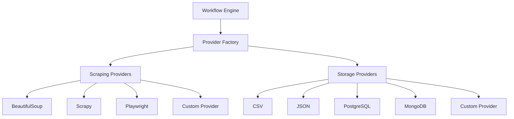
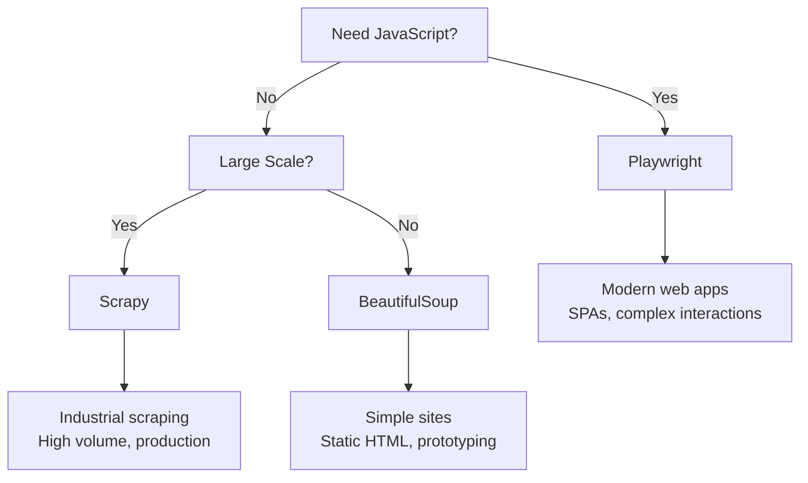
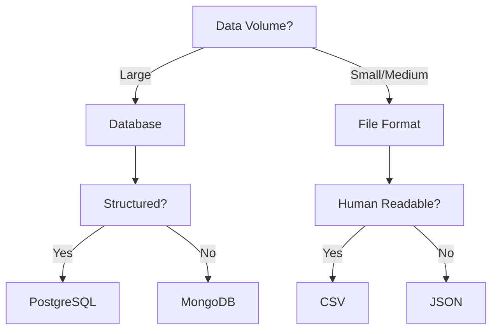

# Provider Architecture

This document explains the provider architecture that makes Web Scrapper CLI extensible and flexible.

## 🏗️ Architecture Overview

The provider architecture separates concerns between the workflow engine and the actual implementation of scraping and storage operations. This design enables:

- **Pluggability**: Swap providers without changing workflows
- **Extensibility**: Add new providers for different technologies
- **Testing**: Mock providers for unit testing
- **Scalability**: Optimize providers for specific use cases



## 🔌 Provider Interface

All providers implement standard interfaces that define their capabilities and contracts.

### Base Provider Interface

```python
from abc import ABC, abstractmethod
from typing import Dict, Any, Optional

class BaseProvider(ABC):
    """Base interface for all providers."""
    
    def __init__(self, config: Dict[str, Any]):
        self.config = config
        self.is_initialized = False
    
    @abstractmethod
    async def initialize(self) -> None:
        """Initialize provider resources."""
        pass
    
    @abstractmethod
    async def cleanup(self) -> None:
        """Clean up provider resources."""
        pass
    
    @abstractmethod 
    def get_capabilities(self) -> Dict[str, Any]:
        """Return provider capabilities and metadata."""
        pass
```

### Scraping Provider Interface

```python
from .base import BaseProvider
from ..models.page_context import PageContext
from ..models.workflow_step import InitStepConfig, DiscoverStepConfig, ExtractStepConfig, PaginateStepConfig

class ScrapingProvider(BaseProvider):
    """Interface for web scraping providers."""
    
    @abstractmethod
    async def execute_init(self, config: InitStepConfig) -> PageContext:
        """Navigate to URL and create initial page context."""
        pass
    
    @abstractmethod
    async def execute_discover(self, config: DiscoverStepConfig, context: PageContext) -> Dict[str, Any]:
        """Discover elements on the page."""
        pass
    
    @abstractmethod
    async def execute_extract(self, config: ExtractStepConfig, context: PageContext) -> List[Dict[str, Any]]:
        """Extract data from page elements."""
        pass
    
    @abstractmethod
    async def execute_paginate(self, config: PaginateStepConfig, context: PageContext) -> Optional[PageContext]:
        """Navigate to next page and return updated context."""
        pass
```

### Storage Provider Interface

```python
from .base import BaseProvider
from typing import List, Dict, Any, Optional

class StorageProvider(BaseProvider):
    """Interface for data storage providers."""
    
    @abstractmethod
    async def connect(self) -> None:
        """Establish connection to storage system."""
        pass
    
    @abstractmethod
    async def disconnect(self) -> None:
        """Close connection to storage system."""
        pass
    
    @abstractmethod
    async def store(self, data: List[Dict[str, Any]], metadata: Optional[Dict[str, Any]] = None) -> Dict[str, Any]:
        """Store extracted data."""
        pass
    
    @abstractmethod
    async def get_schema(self) -> Optional[Dict[str, Any]]:
        """Return storage schema if applicable."""
        pass
```

## 🌐 Scraping Providers

### BeautifulSoup Provider

**Best for**: Simple HTML parsing, lightweight scraping, static content

```python
from .scraping_provider import ScrapingProvider
import aiohttp
from bs4 import BeautifulSoup

class BeautifulSoupProvider(ScrapingProvider):
    """HTTP requests + BeautifulSoup HTML parsing."""
    
    def __init__(self, config: Dict[str, Any]):
        super().__init__(config)
        self.session: Optional[aiohttp.ClientSession] = None
        self.parser = config.get("parser", "lxml")
        self.timeout = config.get("timeout", 30)
    
    async def initialize(self) -> None:
        """Create aiohttp session."""
        connector = aiohttp.TCPConnector(
            limit=self.config.get("connection_limit", 10)
        )
        timeout = aiohttp.ClientTimeout(total=self.timeout)
        self.session = aiohttp.ClientSession(
            connector=connector,
            timeout=timeout,
            headers=self.config.get("headers", {})
        )
        self.is_initialized = True
    
    async def execute_init(self, config: InitStepConfig) -> PageContext:
        """Fetch page and parse HTML."""
        async with self.session.get(config.url) as response:
            html_content = await response.text()
            soup = BeautifulSoup(html_content, self.parser)
            
            return PageContext(
                url=str(response.url),
                title=soup.find("title").get_text() if soup.find("title") else "",
                html_content=html_content,
                dom_tree=soup,
                metadata={
                    "status_code": response.status,
                    "headers": dict(response.headers),
                    "parser": self.parser
                }
            )
```

**Configuration Options:**
```json
{
  "scraping": {
    "provider": "beautifulsoup",
    "config": {
      "parser": "lxml",           // lxml, html.parser, xml
      "timeout": 30,              // Request timeout in seconds
      "headers": {},              // HTTP headers
      "connection_limit": 10,     // Concurrent connections
      "verify_ssl": true,         // SSL certificate verification
      "follow_redirects": true    // Follow HTTP redirects
    }
  }
}
```

### Scrapy Provider

**Best for**: Large-scale scraping, complex sites, production deployments

```python
from .scraping_provider import ScrapingProvider
import scrapy
from scrapy.crawler import CrawlerRunner
from twisted.internet import defer

class ScrapyProvider(ScrapingProvider):
    """Industrial-grade web scraping with Scrapy."""
    
    def __init__(self, config: Dict[str, Any]):
        super().__init__(config)
        self.runner: Optional[CrawlerRunner] = None
        self.spider_class = self._create_spider_class()
    
    def _create_spider_class(self):
        """Dynamically create Scrapy spider class."""
        provider = self
        
        class DynamicSpider(scrapy.Spider):
            name = "scrapper_spider"
            
            def __init__(self, *args, **kwargs):
                super().__init__(*args, **kwargs)
                self.provider = provider
                self.results = []
            
            def start_requests(self):
                # Will be populated by execute_init
                return []
            
            def parse(self, response):
                # Custom parsing logic based on step configuration
                return self.provider._parse_response(response)
        
        return DynamicSpider
    
    async def initialize(self) -> None:
        """Set up Scrapy crawler."""
        settings = {
            'ROBOTSTXT_OBEY': self.config.get('robotstxt_obey', True),
            'CONCURRENT_REQUESTS': self.config.get('concurrent_requests', 16),
            'DOWNLOAD_DELAY': self.config.get('download_delay', 1),
            'RANDOMIZE_DOWNLOAD_DELAY': True,
            'USER_AGENT': self.config.get('user_agent', 'scrapper/1.0.0'),
            'TELNETCONSOLE_ENABLED': False,
        }
        
        self.runner = CrawlerRunner(settings)
        self.is_initialized = True
```

**Configuration Options:**
```json
{
  "scraping": {
    "provider": "scrapy",
    "config": {
      "concurrent_requests": 16,       // Concurrent request limit
      "download_delay": 1,             // Delay between requests (seconds)
      "robotstxt_obey": true,          // Respect robots.txt
      "user_agent": "scrapper/1.0.0",  // User agent string
      "cookies_enabled": true,         // Enable cookies
      "redirect_enabled": true,        // Follow redirects
      "retry_times": 3,                // Retry failed requests
      "retry_http_codes": [500, 502, 503, 504, 408, 429]
    }
  }
}
```

### Playwright Provider

**Best for**: JavaScript-heavy sites, SPAs, complex interactions, taking screenshots

```python
from .scraping_provider import ScrapingProvider
from playwright.async_api import async_playwright, Browser, Page

class PlaywrightProvider(ScrapingProvider):
    """Browser automation with Playwright."""
    
    def __init__(self, config: Dict[str, Any]):
        super().__init__(config)
        self.playwright = None
        self.browser: Optional[Browser] = None
        self.page: Optional[Page] = None
        self.browser_type = config.get("browser", "chromium")
    
    async def initialize(self) -> None:
        """Launch browser instance."""
        self.playwright = await async_playwright().start()
        
        browser_args = []
        if self.config.get("proxy"):
            browser_args.extend(["--proxy-server", self.config["proxy"]])
        
        browser_launcher = getattr(self.playwright, self.browser_type)
        self.browser = await browser_launcher.launch(
            headless=self.config.get("headless", True),
            args=browser_args
        )
        
        # Create browser context with options
        context = await self.browser.new_context(
            viewport=self.config.get("viewport", {"width": 1920, "height": 1080}),
            user_agent=self.config.get("user_agent"),
            extra_http_headers=self.config.get("headers", {})
        )
        
        self.page = await context.new_page()
        self.is_initialized = True
    
    async def execute_init(self, config: InitStepConfig) -> PageContext:
        """Navigate to page and wait for content."""
        # Set cookies if provided
        if config.cookies:
            await self.page.context.add_cookies(config.cookies)
        
        # Navigate to URL
        response = await self.page.goto(
            config.url,
            wait_until=self.config.get("wait_until", "networkidle")
        )
        
        # Wait for specific element or time
        if isinstance(config.wait_for, str):
            await self.page.wait_for_selector(config.wait_for)
        elif isinstance(config.wait_for, int):
            await self.page.wait_for_timeout(config.wait_for)
        
        # Capture screenshot if enabled
        screenshot = None
        if self.config.get("screenshots", False):
            screenshot = await self.page.screenshot()
        
        return PageContext(
            url=self.page.url,
            title=await self.page.title(),
            html_content=await self.page.content(),
            dom_tree=self.page,  # Playwright page object
            screenshot=screenshot,
            metadata={
                "status": response.status,
                "browser": self.browser_type,
                "viewport": self.config.get("viewport")
            }
        )
```

**Configuration Options:**
```json
{
  "scraping": {
    "provider": "playwright",
    "config": {
      "browser": "chromium",          // chromium, firefox, webkit
      "headless": true,               // Run browser in headless mode
      "viewport": {                   // Browser viewport size
        "width": 1920,
        "height": 1080
      },
      "timeout": 30000,               // Navigation timeout
      "wait_until": "networkidle",    // When to consider page loaded
      "screenshots": false,           // Capture screenshots
      "user_agent": "Mozilla/5.0...", // Custom user agent
      "proxy": "http://proxy:8080"    // Proxy server
    }
  }
}
```

## 💾 Storage Providers

### CSV Provider

**Best for**: Simple tabular data, Excel compatibility, human-readable output

```python
from .storage_provider import StorageProvider
import aiofiles
import csv
from io import StringIO

class CSVProvider(StorageProvider):
    """CSV file storage provider."""
    
    async def store(self, data: List[Dict[str, Any]], metadata: Optional[Dict[str, Any]] = None) -> Dict[str, Any]:
        """Write data to CSV file."""
        if not data:
            return {"stored": 0, "message": "No data to store"}
        
        file_path = self.config["file_path"]
        headers = self.config.get("headers", True)
        delimiter = self.config.get("delimiter", ",")
        
        # Prepare CSV content
        output = StringIO()
        fieldnames = data[0].keys()
        writer = csv.DictWriter(output, fieldnames=fieldnames, delimiter=delimiter)
        
        if headers:
            writer.writeheader()
        
        writer.writerows(data)
        csv_content = output.getvalue()
        
        # Write to file
        async with aiofiles.open(file_path, 'w', encoding='utf-8') as f:
            await f.write(csv_content)
        
        return {
            "stored": len(data),
            "file_path": file_path,
            "format": "csv"
        }
```

### PostgreSQL Provider

**Best for**: Relational data, complex queries, high-volume storage

```python
from .storage_provider import StorageProvider
import asyncpg
from typing import List, Dict, Any, Optional

class PostgreSQLProvider(StorageProvider):
    """PostgreSQL database storage provider."""
    
    def __init__(self, config: Dict[str, Any]):
        super().__init__(config)
        self.connection: Optional[asyncpg.Connection] = None
        self.pool: Optional[asyncpg.Pool] = None
    
    async def connect(self) -> None:
        """Establish database connection pool."""
        self.pool = await asyncpg.create_pool(
            self.config["connection_string"],
            min_size=self.config.get("min_connections", 1),
            max_size=self.config.get("max_connections", 10)
        )
        
        # Create table if it doesn't exist
        await self._ensure_table_exists()
    
    async def store(self, data: List[Dict[str, Any]], metadata: Optional[Dict[str, Any]] = None) -> Dict[str, Any]:
        """Insert data into PostgreSQL table."""
        if not data:
            return {"stored": 0}
        
        table_name = self.config["table_name"]
        batch_size = self.config.get("batch_size", 1000)
        
        async with self.pool.acquire() as conn:
            async with conn.transaction():
                stored_count = 0
                
                # Process data in batches
                for i in range(0, len(data), batch_size):
                    batch = data[i:i + batch_size]
                    
                    # Generate INSERT statement
                    columns = list(batch[0].keys())
                    placeholders = [f"${i+1}" for i in range(len(columns))]
                    
                    query = f"""
                        INSERT INTO {table_name} ({', '.join(columns)})
                        VALUES ({', '.join(placeholders)})
                    """
                    
                    # Execute batch insert
                    values_list = [[row[col] for col in columns] for row in batch]
                    await conn.executemany(query, values_list)
                    stored_count += len(batch)
        
        return {"stored": stored_count, "table": table_name}
```

## 🔧 Provider Factory

The provider factory handles provider instantiation and management:

```python
from typing import Dict, Any, Type
from .providers import ScrapingProvider, StorageProvider

class ProviderFactory:
    """Factory for creating provider instances."""
    
    _scraping_providers: Dict[str, Type[ScrapingProvider]] = {
        "beautifulsoup": BeautifulSoupProvider,
        "scrapy": ScrapyProvider,
        "playwright": PlaywrightProvider,
    }
    
    _storage_providers: Dict[str, Type[StorageProvider]] = {
        "csv": CSVProvider,
        "json": JSONProvider,
        "postgresql": PostgreSQLProvider,
        "mongodb": MongoDBProvider,
    }
    
    @classmethod
    def create_scraper(cls, provider_name: str, config: Dict[str, Any]) -> ScrapingProvider:
        """Create scraping provider instance."""
        if provider_name not in cls._scraping_providers:
            raise ValueError(f"Unknown scraping provider: {provider_name}")
        
        provider_class = cls._scraping_providers[provider_name]
        return provider_class(config)
    
    @classmethod
    def create_storage(cls, provider_name: str, config: Dict[str, Any]) -> StorageProvider:
        """Create storage provider instance."""
        if provider_name not in cls._storage_providers:
            raise ValueError(f"Unknown storage provider: {provider_name}")
        
        provider_class = cls._storage_providers[provider_name]
        return provider_class(config)
    
    @classmethod
    def register_scraper(cls, name: str, provider_class: Type[ScrapingProvider]) -> None:
        """Register custom scraping provider."""
        cls._scraping_providers[name] = provider_class
    
    @classmethod
    def register_storage(cls, name: str, provider_class: Type[StorageProvider]) -> None:
        """Register custom storage provider."""
        cls._storage_providers[name] = provider_class
```

## 📊 Provider Selection Guide

### Scraping Provider Selection



### Storage Provider Selection



## 🔌 Custom Providers

You can create custom providers for specific needs:

### Custom Scraping Provider Example

```python
from scraper_core.providers.scraping_provider import ScrapingProvider

class CustomAPIProvider(ScrapingProvider):
    """Custom provider for API-based scraping."""
    
    async def execute_init(self, config: InitStepConfig) -> PageContext:
        # Custom API initialization logic
        pass
    
    async def execute_extract(self, config: ExtractStepConfig, context: PageContext) -> List[Dict[str, Any]]:
        # Custom data extraction from API
        pass

# Register the custom provider
from scraper_core.providers import ProviderFactory
ProviderFactory.register_scraper("custom_api", CustomAPIProvider)
```

### Custom Storage Provider Example

```python
from scraper_core.providers.storage_provider import StorageProvider

class CustomS3Provider(StorageProvider):
    """Custom provider for AWS S3 storage."""
    
    async def store(self, data: List[Dict[str, Any]], metadata: Optional[Dict[str, Any]] = None) -> Dict[str, Any]:
        # Custom S3 upload logic
        pass

# Register the custom provider
ProviderFactory.register_storage("s3", CustomS3Provider)
```

---

## 🎯 Next Steps

- **[Scraping Providers](scraping.md)** - Detailed guide to scraping providers
- **[Storage Providers](storage.md)** - Complete storage provider reference  
- **[Custom Providers](custom.md)** - Build your own providers
- **[Best Practices](../examples/best-practices.md)** - Production deployment patterns

---

The provider architecture is the foundation of Web Scrapper CLI's flexibility and extensibility, enabling you to adapt to any scraping scenario.