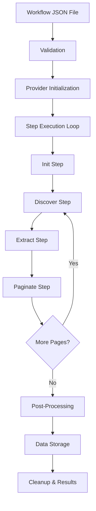
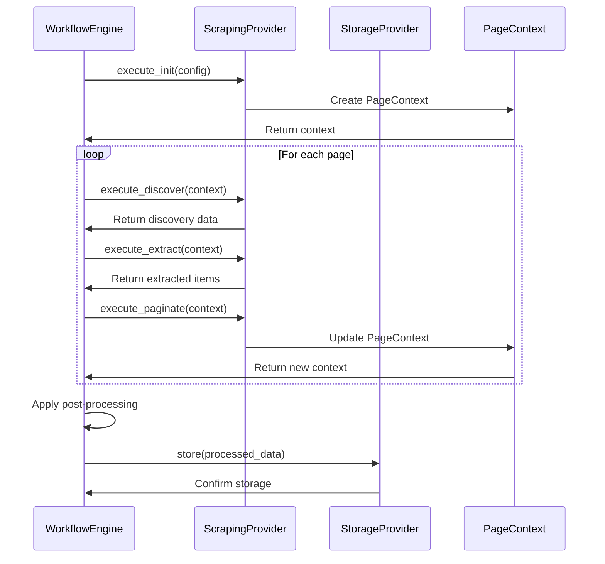

# Workflow Overview

This document provides a comprehensive overview of how workflows are executed in the Web Scrapper CLI system, from initialization to data storage.

## 🔄 Workflow Execution Process

The Web Scrapper CLI follows a structured, step-based execution model that ensures reliable and scalable web scraping operations.

### High-Level Flow



## 📋 Detailed Execution Steps

### 1. Workflow Validation Phase

Before execution begins, the workflow undergoes comprehensive validation:

```python
# Validation checks performed:
✓ JSON schema validation (Pydantic models)
✓ Provider availability verification
✓ Configuration completeness check
✓ Step dependency validation
✓ Resource requirement analysis
```

**Key Components Validated:**
- Workflow metadata and version compatibility
- Provider configurations (scraping + storage)
- Step definitions and execution order
- Post-processing rules validity

### 2. Provider Initialization Phase

Two types of providers are initialized:

#### Scraping Provider Setup
```python
# Available providers: beautifulsoup, scrapy, playwright
scraping_provider = ProviderFactory.create_scraper(
    provider_name=workflow.scraping.provider,
    config=workflow.scraping.config
)
await scraping_provider.initialize()
```

#### Storage Provider Setup
```python
# Available providers: csv, json, postgresql, mongodb, sqlite
storage_provider = ProviderFactory.create_storage(
    provider_name=workflow.storage.provider,
    config=workflow.storage.config
)
await storage_provider.connect()
```

### 3. Step Execution Loop

Each workflow step is executed in sequence with built-in error handling and retry logic:

#### Step Execution Pattern
```python
for step in workflow.steps:
    context = None
    for attempt in range(step.retries + 1):
        try:
            # Execute step with timeout
            result = await asyncio.wait_for(
                execute_step(step, provider, context),
                timeout=step.timeout / 1000
            )
            
            # Update context for next step
            if step.command == "init":
                context = result  # PageContext
            elif step.command in ["discover", "extract"]:
                extracted_data.extend(result)
            elif step.command == "paginate":
                context = result  # Updated PageContext
                
            break  # Success, exit retry loop
            
        except Exception as e:
            if attempt < step.retries:
                await asyncio.sleep(backoff_delay)
                continue
            elif step.continue_on_error:
                log_warning(f"Step {step.id} failed, continuing...")
                break
            else:
                raise WorkflowExecutionError(e)
```

## 🔧 Step Types and Their Roles

### Init Step
**Purpose**: Navigate to target website and establish initial page context

```json
{
  "id": "init",
  "command": "init",
  "config": {
    "url": "https://example.com",
    "wait_for": "body",
    "headers": {},
    "cookies": []
  }
}
```

**Execution Flow:**
1. Navigate to target URL
2. Apply headers and cookies
3. Wait for page load completion
4. Create PageContext with DOM and metadata
5. Return context for subsequent steps

### Discover Step
**Purpose**: Analyze page structure and identify data elements

```json
{
  "id": "discover",
  "command": "discover", 
  "config": {
    "selectors": {
      "items": ".product-item",
      "pagination": ".next-page"
    }
  }
}
```

**Execution Flow:**
1. Receive PageContext from previous step
2. Apply CSS selectors to identify elements
3. Count available items and pagination links
4. Return discovery metadata

### Extract Step
**Purpose**: Extract actual data from identified elements

```json
{
  "id": "extract",
  "command": "extract",
  "config": {
    "elements": {
      "title": {"selector": "h2", "type": "text"},
      "price": {"selector": ".price", "type": "text", "transform": "float"},
      "url": {"selector": "a", "type": "attribute", "attribute": "href"}
    }
  }
}
```

**Execution Flow:**
1. Use PageContext to locate elements
2. Apply extraction rules for each element
3. Transform data according to type specifications
4. Return array of extracted data objects

### Paginate Step
**Purpose**: Navigate to next page and continue extraction

```json
{
  "id": "paginate", 
  "command": "paginate",
  "config": {
    "next_page_selector": ".next-page",
    "max_pages": 10,
    "wait_after_click": 2000
  }
}
```

**Execution Flow:**
1. Check for next page link availability
2. Click next page link if available
3. Wait for page load completion
4. Return updated PageContext
5. Loop back to discover/extract if more pages exist

## 🔄 Data Flow Between Steps



## 🔧 Error Handling and Recovery

### Retry Mechanism
Each step includes configurable retry logic with exponential backoff:

```python
# Step-level retry configuration
{
  "retries": 3,              # Number of retry attempts
  "timeout": 30000,          # Timeout per attempt (ms)
  "continue_on_error": false # Fail-fast vs. continue behavior
}
```

### Error Recovery Strategies

1. **Network Errors**: Automatic retry with increasing delays
2. **Element Not Found**: Retry with different selectors
3. **Rate Limiting**: Exponential backoff with jitter
4. **Provider Failures**: Graceful degradation and cleanup
5. **Storage Errors**: Transaction rollback and retry

### Logging and Monitoring

```python
# Comprehensive execution logging
INFO  - Workflow 'news-scraper' started
INFO  - Step 'init' executing (attempt 1/4)
INFO  - Navigated to https://news.example.com 
INFO  - Step 'discover' found 25 articles
INFO  - Step 'extract' processed 25 items
WARN  - Step 'paginate' failed (attempt 1/4): Element not found
INFO  - Step 'paginate' succeeded (attempt 2/4)
INFO  - Post-processing: filtered 2 items, transformed 23 items
INFO  - Stored 23 items to CSV file
INFO  - Workflow completed successfully
```

## 📊 Performance Characteristics

### Concurrency Model
- **Async/Await**: Non-blocking I/O operations
- **Semaphore Limiting**: Controlled concurrent requests
- **Connection Pooling**: Efficient resource utilization

### Memory Management
- **Streaming Processing**: Process items as they're extracted
- **Batch Storage**: Efficient database writes
- **Context Cleanup**: Automatic resource deallocation

### Scalability Features
- **Rate Limiting**: Configurable request throttling
- **Resource Monitoring**: Memory and CPU usage tracking
- **Graceful Degradation**: Adaptive performance under load

---

## 🎯 Next Steps

- **Step Configuration**: Learn about [Step Types](step-types.md) in detail
- **Provider Selection**: Understand [Provider Architecture](../providers/architecture.md)
- **Error Handling**: Master [Flow Control](flow-control.md) techniques
- **Performance**: Explore [Best Practices](../examples/best-practices.md)

---

This overview provides the foundation for understanding how Web Scrapper CLI orchestrates complex scraping operations through its workflow system.