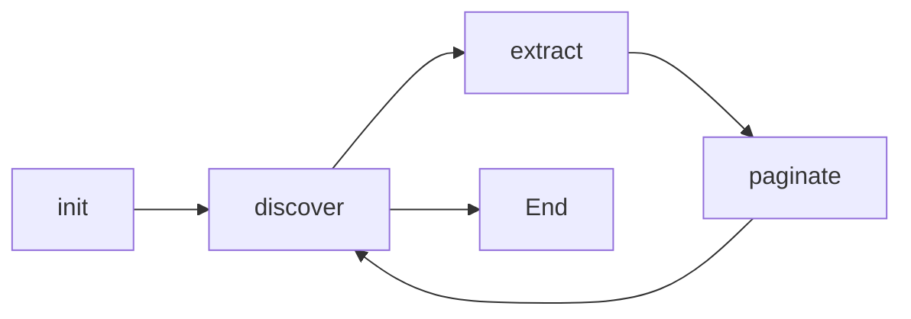

# Step Types

This document provides detailed information about each workflow step type available in the Web Scrapper CLI, including configuration options, execution behavior, and best practices.

## 🎯 Step Type Overview

The Web Scrapper CLI supports four core step types that work together to create comprehensive scraping workflows:

| Step Type | Purpose | Required | Input | Output |
|-----------|---------|----------|-------|--------|
| **init** | Navigate to target URL | ✅ Yes | Workflow config | PageContext |
| **discover** | Identify page elements | ⚪ Optional | PageContext | Element metadata |
| **extract** | Extract data from elements | ✅ Yes | PageContext | Data objects |
| **paginate** | Navigate to next page | ⚪ Optional | PageContext | Updated PageContext |

## 🚀 Init Step

The **init** step is responsible for navigating to the target website and establishing the initial page context.

### Basic Configuration

```json
{
  "id": "init-website",
  "command": "init",
  "config": {
    "url": "https://example.com",
    "wait_for": "body"
  },
  "retries": 3,
  "timeout": 30000
}
```

### Advanced Configuration

```json
{
  "id": "init-with-auth",
  "command": "init",
  "config": {
    "url": "https://secure.example.com/login",
    "wait_for": "#content-loaded",
    "headers": {
      "User-Agent": "Mozilla/5.0 (compatible; scrapper/1.0)",
      "Accept-Language": "en-US,en;q=0.9"
    },
    "cookies": [
      {
        "name": "session_id",
        "value": "abc123",
        "domain": "example.com",
        "path": "/",
        "secure": true
      }
    ],
    "viewport": {
      "width": 1920,
      "height": 1080
    },
    "javascript_enabled": true
  }
}
```

### Configuration Options

| Option | Type | Required | Description | Default |
|--------|------|----------|-------------|---------|
| `url` | string | ✅ Yes | Target URL to navigate to | - |
| `wait_for` | string/number | ⚪ No | CSS selector or milliseconds to wait | `"body"` |
| `headers` | object | ⚪ No | HTTP headers to send | `{}` |
| `cookies` | array | ⚪ No | Cookies to set before navigation | `[]` |
| `viewport` | object | ⚪ No | Browser viewport size (Playwright only) | `{width: 1280, height: 720}` |
| `javascript_enabled` | boolean | ⚪ No | Enable JavaScript execution | `true` |

### Output: PageContext

```python
class PageContext:
    url: str                    # Current page URL
    title: str                  # Page title
    html_content: str          # Raw HTML content  
    dom_tree: Any              # Parsed DOM tree
    screenshot: Optional[bytes] # Page screenshot (if enabled)
    metadata: Dict[str, Any]   # Provider-specific metadata
    cookies: List[Cookie]      # Current cookies
    loading_time: float        # Page load time in seconds
```

### Provider-Specific Behavior

#### BeautifulSoup Provider
- Makes HTTP request to URL
- Parses HTML with specified parser (lxml, html.parser)
- No JavaScript execution
- Fast and lightweight

#### Scrapy Provider
- Uses Scrapy Request/Response cycle
- Supports middleware and pipelines
- Handles redirects and cookies automatically
- Excellent for large-scale scraping

#### Playwright Provider
- Launches real browser instance
- Full JavaScript support
- Can take screenshots
- Handles complex SPA applications

## 🔍 Discover Step

The **discover** step analyzes the page structure and identifies elements available for extraction.

### Basic Configuration

```json
{
  "id": "discover-products",
  "command": "discover",
  "config": {
    "selectors": {
      "items": ".product-item",
      "pagination": ".pagination .next"
    }
  }
}
```

### Advanced Configuration

```json
{
  "id": "discover-dynamic",
  "command": "discover",
  "config": {
    "selectors": {
      "items": ".product-item, .listing-item",
      "pagination": ".next-page:not(.disabled)",
      "load_more": "[data-action='load-more']"
    },
    "wait_for_dynamic": true,
    "scroll_to_load": true,
    "max_scroll_attempts": 5,
    "item_validation": {
      "min_items": 1,
      "required_children": ["h2", ".price"]
    }
  }
}
```

### Configuration Options

| Option | Type | Required | Description |
|--------|------|----------|-------------|
| `selectors` | object | ✅ Yes | CSS selectors for different element types |
| `wait_for_dynamic` | boolean | ⚪ No | Wait for dynamic content loading |
| `scroll_to_load` | boolean | ⚪ No | Scroll to trigger lazy loading |
| `max_scroll_attempts` | number | ⚪ No | Maximum scroll attempts |
| `item_validation` | object | ⚪ No | Validation rules for discovered items |

### Output: Discovery Metadata

```json
{
  "discovered_items": 25,
  "pagination_available": true,
  "load_more_available": false,
  "item_selectors": [".product-item"],
  "pagination_selectors": [".next-page"],
  "page_structure": {
    "has_infinite_scroll": false,
    "estimated_total_pages": 10
  }
}
```

## 📊 Extract Step

The **extract** step extracts actual data from the discovered elements.

### Basic Configuration

```json
{
  "id": "extract-products",
  "command": "extract",
  "config": {
    "elements": {
      "title": {
        "selector": "h2.product-title",
        "type": "text"
      },
      "price": {
        "selector": ".price",
        "type": "text",
        "transform": "float"
      },
      "url": {
        "selector": "a",
        "type": "attribute",
        "attribute": "href"
      }
    }
  }
}
```

### Advanced Configuration

```json
{
  "id": "extract-complex",
  "command": "extract",
  "config": {
    "container_selector": ".product-item",
    "elements": {
      "title": {
        "selector": "h2, .title",
        "type": "text",
        "required": true,
        "transform": "strip"
      },
      "price": {
        "selector": ".price, .cost",
        "type": "text",
        "transform": "currency_to_float",
        "default": 0.0,
        "validation": {
          "min": 0,
          "max": 10000
        }
      },
      "rating": {
        "selector": ".stars",
        "type": "attribute",
        "attribute": "data-rating",
        "transform": "float",
        "default": null
      },
      "image": {
        "selector": "img",
        "type": "attribute", 
        "attribute": "src",
        "transform": "absolute_url"
      },
      "description": {
        "selector": ".description",
        "type": "html",
        "transform": ["strip_tags", "normalize_whitespace"]
      },
      "availability": {
        "selector": ".stock-status",
        "type": "text",
        "transform": "boolean",
        "mapping": {
          "in stock": true,
          "out of stock": false
        }
      }
    }
  }
}
```

### Element Configuration Options

| Option | Type | Required | Description |
|--------|------|----------|-------------|
| `selector` | string | ✅ Yes | CSS selector for element |
| `type` | string | ✅ Yes | `text`, `html`, `attribute`, `data` |
| `attribute` | string | ⚪ Conditional | Required when type is `attribute` |
| `required` | boolean | ⚪ No | Skip item if element missing |
| `default` | any | ⚪ No | Default value if element missing |
| `transform` | string/array | ⚪ No | Data transformation functions |
| `validation` | object | ⚪ No | Validation rules |
| `mapping` | object | ⚪ No | Value mapping dictionary |

### Data Transformation Functions

| Transform | Description | Example |
|-----------|-------------|---------|
| `strip` | Remove leading/trailing whitespace | `"  text  "` → `"text"` |
| `float` | Convert to floating point | `"19.99"` → `19.99` |
| `int` | Convert to integer | `"42"` → `42` |
| `boolean` | Convert to boolean | `"true"` → `true` |
| `currency_to_float` | Extract float from currency | `"$19.99"` → `19.99` |
| `absolute_url` | Convert relative to absolute URL | `"/path"` → `"https://site.com/path"` |
| `strip_tags` | Remove HTML tags | `"<b>text</b>"` → `"text"` |
| `normalize_whitespace` | Normalize whitespace | `"text   \n  more"` → `"text more"` |

### Output: Extracted Data

```json
[
  {
    "title": "Product Name",
    "price": 29.99,
    "url": "https://example.com/product/123",
    "rating": 4.5,
    "availability": true,
    "extracted_at": "2025-01-15T10:30:00Z",
    "source_url": "https://example.com/products"
  }
]
```

## 📄 Paginate Step

The **paginate** step navigates to the next page to continue extraction.

### Basic Configuration

```json
{
  "id": "next-page",
  "command": "paginate",
  "config": {
    "next_page_selector": ".pagination .next",
    "max_pages": 10
  }
}
```

### Advanced Configuration

```json
{
  "id": "smart-pagination",
  "command": "paginate", 
  "config": {
    "next_page_selector": ".next-page:not(.disabled)",
    "load_more_selector": "[data-action='load-more']",
    "pagination_type": "click_next",
    "max_pages": 50,
    "wait_after_click": 2000,
    "scroll_before_click": true,
    "stop_conditions": {
      "no_new_items": true,
      "duplicate_content": true,
      "error_threshold": 3
    },
    "url_pattern": "/page/{page}",
    "start_page": 1
  }
}
```

### Configuration Options

| Option | Type | Required | Description |
|--------|------|----------|-------------|
| `next_page_selector` | string | ⚪ No | CSS selector for next page link |
| `load_more_selector` | string | ⚪ No | CSS selector for load more button |
| `pagination_type` | string | ⚪ No | `click_next`, `load_more`, `url_pattern` |
| `max_pages` | number | ⚪ No | Maximum pages to process |
| `wait_after_click` | number | ⚪ No | Wait time after navigation (ms) |
| `scroll_before_click` | boolean | ⚪ No | Scroll to element before clicking |
| `stop_conditions` | object | ⚪ No | Conditions to stop pagination |
| `url_pattern` | string | ⚪ No | URL pattern for direct navigation |

### Pagination Strategies

#### Click-Based Navigation
```javascript
// Clicks "Next" button or link
await page.click('.pagination .next');
await page.waitForNavigation();
```

#### Load More Button
```javascript
// Clicks "Load More" for infinite scroll
await page.click('[data-load-more]');
await page.waitForSelector('.new-items');
```

#### URL Pattern Navigation
```javascript
// Direct URL navigation
for (let page = 1; page <= maxPages; page++) {
  await page.goto(`/products?page=${page}`);
}
```

### Stop Conditions

```json
{
  "stop_conditions": {
    "no_new_items": true,        // Stop if no new items discovered
    "duplicate_content": true,   // Stop if content is duplicate
    "error_threshold": 3,        // Stop after N consecutive errors
    "max_empty_pages": 2,        // Stop after N empty pages
    "content_similarity": 0.95   // Stop if pages are too similar
  }
}
```

## 🔧 Step Execution Context

### Execution Order

Steps must follow a logical execution order:



### Context Passing

Each step receives and potentially modifies the execution context:

```python
# Step execution with context
context = None

# Init step creates initial context
context = await execute_init_step(step, provider, None)

# Discover step analyzes context
discovery = await execute_discover_step(step, provider, context)

# Extract step uses context to extract data  
data = await execute_extract_step(step, provider, context)

# Paginate step updates context for next iteration
context = await execute_paginate_step(step, provider, context)
```

### Error Handling Per Step

Each step type has specific error handling strategies:

#### Init Step Errors
- **Network timeout**: Retry with exponential backoff
- **404/403 errors**: Fail fast with clear error message
- **SSL errors**: Retry with different SSL configuration

#### Discover Step Errors  
- **No elements found**: Continue with warning
- **Selector errors**: Try alternative selectors
- **Dynamic loading timeout**: Increase wait time

#### Extract Step Errors
- **Missing elements**: Use default values or skip
- **Transform errors**: Log warning and use raw value
- **Validation errors**: Skip invalid items

#### Paginate Step Errors
- **No next page**: Normal termination
- **Navigation timeout**: Retry with longer timeout  
- **Element not found**: Check stop conditions

---

## 🎯 Next Steps

- **Configuration**: Learn [Workflow Configuration](../user-guide/workflow-configuration.md)
- **Post-Processing**: Understand [Post-Processing](post-processing.md) options
- **Error Handling**: Master [Flow Control](flow-control.md)
- **Examples**: See [Industry Examples](../examples/industry.md)

---

This detailed reference covers all step types and their configuration options for building robust scraping workflows.